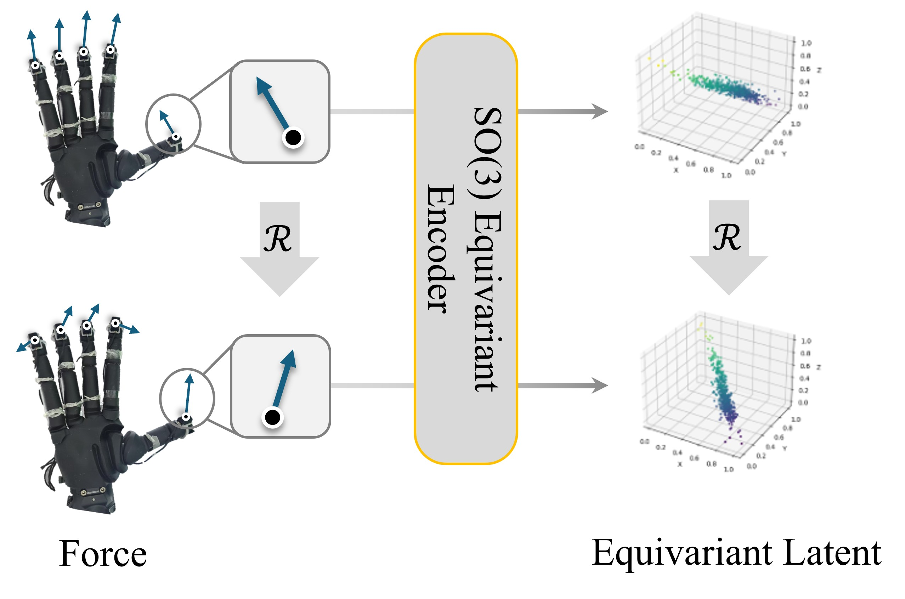

# Dex-EquiTact

Official PyTorch implementation of Dex-EquiTact for reactive dexterous
manipulation using vision, proprioception and three-axis fingertip forces.
It includes a typed equivariant tactile encoder, causal diffusion policy,
future-force latent supervision, training with checkpoint recovery and streaming
inference.

## Method overview



- **Typed tactile state.** Separate causal vector-neuron streams encode wrist-frame
  fingertip positions and calibrated sensor-local forces under independent SO(3)
  rotations. The state retains both vector types and all five fingers in the order
  **thumb, index, middle, ring, little**: `[B,T,5,2,Cv,3]`.
- **Shared visual conditioning.** Two slow RGB/proprioceptive observations produce
  cached tokens and scalar FiLM gains. FiLM preserves the vector field; the action
  expert also attends directly to the cached slow tokens. Flattening occurs inside
  the action expert, so equivariance is a property of the typed representation,
  not a claim about the complete action policy.
- **Causal reactive diffusion.** The denoiser predicts injected noise (epsilon),
  with causal action–action and action–tactile attention. Deterministic DDIM
  (`eta=0`) resamples the arrived prefix using cached original noise and context.
  At each tactile arrival, only the newest action is returned for execution.
- **Future-force learning.** Each of 16 tactile origins predicts the next 8 force
  latent states from the shared FiLM representation. A force-only EMA encoder
  provides detached targets and updates after each optimizer step. The predictor
  and teacher are used only during training; neither requires action input.

See the [method guide](docs/METHOD.md) for the formulation and
[architecture guide](docs/ARCHITECTURE.md) for modules, tensor shapes and the
default configuration.

## Installation and quick start

Requires Python **3.10+**, PyTorch **2.2+**, NumPy and PyYAML.

```bash
git clone https://github.com/anon-mity/Dex-EquiTact.git
cd Dex-EquiTact
python -m venv .venv
source .venv/bin/activate
python -m pip install -e '.[dev]'

python -m dex_equitact --help
```

The installed CLI is also available as `dex-equitact`. Without an editable install,
run from the repository root with `PYTHONPATH=src python -m dex_equitact ...`.
Use `python -m dex_equitact train --help` to inspect training options.

## Embodiment profiles

Train a separate policy for each embodiment:

| Profile | Configuration | Action layout | Proprioception width |
| --- | --- | --- | --- |
| WUJI | [wuji.yaml](configs/wuji.yaml) | 6 arm increments + 20 hand targets = 26 | 26 |
| Sharpa | [sharpa.yaml](configs/sharpa.yaml) | 6 arm increments + 22 hand targets = 28 | 28 |

The default configuration for both profiles uses two cameras, two slow
observations, 16 tactile/action slots and 8 future-force target steps, with
32 vector channels, an action transformer width of 128, 1000 training diffusion
levels and 10 DDIM updates.

## Prepare recorded data

Prepare your demonstrations using the [recorded data schema](docs/DATA_FORMAT.md):
a `manifest.json` explicitly lists NPZ episodes containing `images`, `proprio`,
`positions`, `forces`, `actions`, `timestamps` and `image_timestamps`. Metadata
declares finger order, coordinate frames, units, calibration provenance and the
complete action convention.

Positions must be recorded or independently validated wrist-frame fingertip
locations in meters; forces are calibrated sensor-local vectors in Newtons.
Geometry, missing timestamps and absolute-to-increment action conversion must be
supplied by the data producer. The [optional Zarr adapter](scripts/convert_zarr.py)
is described in the schema document.

Training splits whole episodes and fits normalization only on training episodes.
Position and force each use one scalar shared across XYZ, fingers and time, with
no vector offset; actions and proprioception use per-component mean/std.
Training needs separate usable train/validation episodes; the default window
requires at least 40 aligned frames. `--slow-stride` defaults to 16 fast-grid
samples between slow observations. Set it from the actual acquisition protocol;
it does not declare a physical sampling frequency.

## Train, resume and evaluate

Replace `/path/to/dataset` with a dataset prepared above. Use `--device cpu` for
CPU execution, or `--device cuda` with a working CUDA installation.

```bash
python -m dex_equitact validate-data --data /path/to/dataset

python -m dex_equitact train --config configs/wuji.yaml \
  --data /path/to/dataset --output runs/wuji --device cuda \
  --steps 100000 --batch-size 8 --save-every 1000

python -m dex_equitact train --config configs/wuji.yaml \
  --data /path/to/dataset --output runs/wuji --device cuda \
  --steps 200000 --batch-size 8 --save-every 1000 --resume runs/wuji/last.pt

python -m dex_equitact evaluate --data /path/to/dataset \
  --checkpoint runs/wuji/last.pt --device cuda
```

`--steps` is the **target total optimizer step count**, including resumed steps.
Keep the model configuration, data and recorded training settings unchanged when
resuming. For Sharpa, use `configs/sharpa.yaml` and a separate output directory.

`last.pt` stores online/EMA weights, optimizer and random states, normalization,
episode split, configuration and a dataset content fingerprint. `run.json` records
provenance and `metrics.jsonl` logs losses, including validation at each checkpoint.
Evaluation uses the checkpoint's held-out split and reports action-denoising and
latent losses.

## Streaming API

The example below assumes observations have already been acquired. Use float32
tensors on the policy's device, with `B` batch items, `V` cameras and `P`
proprioceptive components matching the checkpoint; `H,W` must each be at least 8.

```python
from dex_equitact.training import load_policy
from dex_equitact.streaming import ReactiveController

policy, normalizer, checkpoint = load_policy("runs/wuji/last.pt", device="cpu")
controller = ReactiveController(policy, normalizer)  # policy is already in eval mode

# Two already available slow observations:
# images: [B,2,V,3,H,W], RGB in [0,1]; proprio: [B,2,P], recorded physical units.
controller.start_cycle(images, proprio, timestamp=visual_time)

# Call once for each newly arrived tactile frame, in the declared finger order.
# positions: [B,5,3], wrist-frame meters; forces: [B,5,3], sensor-local Newtons.
latest_action = controller.step(positions, forces, timestamp=tactile_time)
# [B,26] or [B,28], denormalized to the recorded action convention.
# The caller executes this newest action.
```

With the checkpoint normalizer, supply physical-unit proprioception/tactile input
and receive physical-unit actions. With `ReactiveController(policy)` instead, all
nonimage inputs and outputs are **normalized values**. RGB always remains `[0,1]`.

Pass finite timestamps in seconds. Each tactile timestamp must be at or after its
cycle start and strictly newer than the preceding tactile timestamp. A cycle
accepts at most 16 `step` calls; call `start_cycle` when a new slow observation
arrives to refresh context, clear tactile history and cache new noise.
The caller owns hardware I/O and interprets arm translation frames, rotation
composition and hand target units exactly as declared in the dataset manifest.

## Tests

```bash
python -m pytest -q
```

The test suite covers typed rotations, finger ordering, causality, DDIM prefix
consistency, EMA targets, both streaming profiles, data contracts and
checkpoint/resume behavior. See the [testing guide](docs/TESTING.md) for coverage
and commands.

## Repository map

| Area | Source |
| --- | --- |
| Typed VN encoder, FiLM, future-force head | [vn.py](src/dex_equitact/models/vn.py), [tactile.py](src/dex_equitact/models/tactile.py) |
| Slow visual/proprioceptive tokens | [vision.py](src/dex_equitact/models/vision.py) |
| Causal denoiser and DDIM | [diffusion.py](src/dex_equitact/models/diffusion.py) |
| Shared state, joint loss and EMA | [policy.py](src/dex_equitact/policy.py) |
| Reactive inference and cycle cache | [streaming.py](src/dex_equitact/streaming.py) |
| Data, normalization and training lifecycle | [data.py](src/dex_equitact/data.py), [training.py](src/dex_equitact/training.py) |
| Configuration, CLI and tests | [config.py](src/dex_equitact/config.py), [cli.py](src/dex_equitact/cli.py), [tests/](tests) |

## License

Released under the [MIT License](LICENSE).
