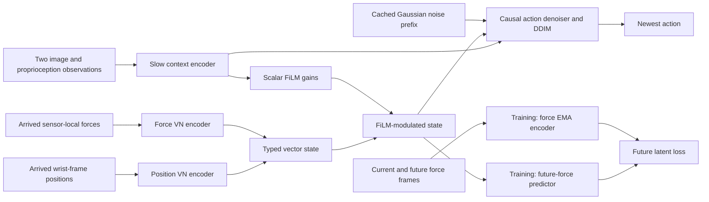

# Architecture and interfaces

The package separates recorded data, policy computation, training, and streaming control. `DexEquiTactPolicy` owns the slow encoder, typed tactile encoder, FiLM, action denoiser, diffusion schedule, future-force predictor, and force EMA teacher. `ReactiveController` manages the observation cache and emits the newest action on each tactile arrival.

## Source modules

| Module | Responsibilities |
| --- | --- |
| [config.py](../src/dex_equitact/config.py) | Validated policy dimensions, horizons, model widths, diffusion, and EMA settings |
| [models/vision.py](../src/dex_equitact/models/vision.py) | Multi-view image tokens and proprioception tokens |
| [models/vn.py](../src/dex_equitact/models/vn.py) | Equivariant vector channel maps, normalization, gates, and causal attention |
| [models/tactile.py](../src/dex_equitact/models/tactile.py) | Position/force streams, typed stacking, scalar FiLM, and future-force prediction |
| [models/diffusion.py](../src/dex_equitact/models/diffusion.py) | Causal noise prediction, forward corruption, and deterministic DDIM |
| [policy.py](../src/dex_equitact/policy.py) | Shared state, joint losses, force target indexing, and teacher updates |
| [streaming.py](../src/dex_equitact/streaming.py) | Visual-cycle cache, growing tactile prefix, timestamps, and action output |
| [data.py](../src/dex_equitact/data.py) | Manifest validation, episode windows, splits, and normalization |
| [training.py](../src/dex_equitact/training.py) | Optimization, held-out evaluation, checkpointing, resume, and loading |
| [cli.py](../src/dex_equitact/cli.py) | `validate-data`, `train`, and `evaluate` commands |

## Tensor interfaces

`B` denotes batch size, `T` an arrived prefix length from 1 to 16, `V` the camera count, `P` the proprioception width, `A` the action width, and `Cv` the vector-channel count. Default widths are `Cv=32` and `model_dim=128`. The five-finger axis always follows thumb, index, middle, ring, little.

| Tensor | Shape | Meaning |
| --- | --- | --- |
| `images` | `[B,2,V,3,H,W]` | Two available RGB observations, float `[0,1]`; `H,W >= 8` for the visual encoder |
| `proprio` | `[B,2,P]` | Proprioception at the same two slow observations |
| `positions`, `forces` | `[B,T,5,3]` each | Current tactile prefix |
| Position / force encoder output | `[B,T,5,Cv,3]` each | Causal vector field for each type |
| Typed field / FiLM output | `[B,T,5,2,Cv,3]` | Type 0: position; type 1: force |
| FiLM gains | `[B,5,Cv]` | Scalars broadcast over time, type, and XYZ |
| Slow context | `[B,2*(4*V+1),model_dim]` | Four image tokens per view/observation plus two proprioception tokens |
| Internal action tactile tokens | `[B,5*T,model_dim]` | Per-finger projection of the typed field |
| Noisy actions / predicted noise / sampled prefix | `[B,T,A]` | Action-side diffusion tensors |
| `future_forces` | `[B,8,5,3]` | Training-only continuation after the 16 current force frames |
| Future predictions / EMA targets | `[B,16,8,5,Cv,3]` | Eight future force latents at each action origin |
| Controller action | `[B,A]` | Newest sampled action |

The tactile encoders operate on wrist-frame position vectors and sensor-local force vectors separately. Their independent `SO(3)` transformation laws apply to these vector fields and scalar FiLM modulation. The scalar action expert projects each finger's `[2,Cv,3]` values into a token; its full policy output has no corresponding equivariance constraint. See [Method](METHOD.md) for the equations.

## Temporal data flow

A training window contains two slow observations, 16 aligned tactile/action slots, and eight target-only force frames. With the default `slow_stride=16` and anchor `s`, slow observations come from `[s-16,s]`, current tactile/action inputs from `s:s+16`, and the force continuation from `s+16:s+24`. The teacher encodes the 24-frame force sequence causally and gathers target `j+d` for each zero-based origin `j=0,...,15` and horizon `d=1,...,8`.

Visibility is enforced at each temporal interface:

| Query | Visible keys |
| --- | --- |
| Tactile time `r`, any finger | Every finger at tactile times `u <= r` |
| Action time `r`, self-attention | Action slots `u <= r` |
| Action time `r`, cross-attention | All slow context tokens and every finger at tactile times `u <= r` |
| Future-force predictor at `j` | The shared causal state at `j` |
| Force EMA target at `j+d` | Force inputs through `j+d` |

Slow/tactile memory is read-only inside action attention. Normalization is per token, diffusion layers have zero dropout, and time embeddings keep absolute indices within the cycle. These choices preserve prefix behavior when the controller extends a sequence. Attention's boolean masks mark blocked keys with `True` at the PyTorch `MultiheadAttention` interface.

## Policy and training lifecycle

`DexEquiTactPolicy.loss(batch)` expects normalized inputs with a full 16-step action window. It computes detached force EMA targets, encodes slow context and the current tactile window, applies FiLM, corrupts actions with Gaussian noise, and evaluates action-noise and future-latent losses. It returns `loss`, `action_loss`, and `prediction_loss`. Optional `timesteps` and `noise` arguments allow a fixed diffusion input for controlled comparisons.

The trainer splits by episode, fits statistics on training episodes, and samples full training windows uniformly with replacement. Each step performs gradient clearing, loss computation, backpropagation, norm clipping, an AdamW update, and one EMA update. The teacher is excluded from the optimizer and stays in evaluation mode even when the policy enters training mode.

`evaluate(policy, dataset, ...)` averages held-out losses by sample count. It temporarily switches to evaluation mode and uses an isolated seeded diffusion random stream, then restores the previous training mode. The metrics measure denoising and latent prediction error. The CLI evaluates the checkpoint's saved holdout split and checks that the dataset fingerprint matches.

The training directory contains:

- `run.json`: policy configuration, training settings, split, dataset fingerprint, and software/device metadata.
- `metrics.jsonl`: per-step training losses and periodic validation losses.
- `last.pt`: model state including the teacher, optimizer, normalizer, split, step, configuration, dataset fingerprint, window-sampling state, and random-generator states.

Checkpoints are saved by atomic replacement. Resume treats `--steps` as the total desired optimizer-step count and requires the same policy configuration, training settings, and dataset contents. `load_policy(path, device)` loads the supported checkpoint format with strict model keys and returns an evaluation-mode policy, its normalizer, and the checkpoint dictionary.

## Streaming lifecycle

Construct `ReactiveController(policy, normalizer)` with an evaluation-mode policy. With a normalizer, its observation inputs use the dataset's physical units and its output uses the saved action convention. Without a normalizer, proprioception, tactile inputs, and output actions use normalized coordinates. Images always use floating RGB in `[0,1]`.

1. Call `start_cycle(images, proprio, timestamp=...)` with the two slow observations already available at that time. The controller computes and copies slow context and FiLM gains, caches a full `[B,16,A]` Gaussian noise tensor, and clears the previous tactile prefix. Supply `initial_noise` for fixed noise or a `generator` to control sampling.
2. Call `step(positions, forces, timestamp=...)` once per arriving `[B,5,3]` tactile block. The controller builds the arrived prefix, recomputes its typed state, runs DDIM from the original noise prefix, and returns only `[B,A]`, the newest action.
3. Start a new cycle when a new visual context is ready. A cycle permits at most 16 successful steps; the next step requires a new cycle.

Tactile timestamps must be finite and strictly increasing across cycles. The first block may share its cycle-start timestamp, but cannot repeat a previous tactile timestamp. A new cycle cannot precede the last tactile observation. Failed inference leaves the arriving block uncommitted; successful inference appends it and advances the timestamp.

The controller calls neither the future predictor nor the EMA teacher. It owns policy state and action generation; the application owns sensor acquisition, observation availability, scheduling, and actuator execution. Recorded units, calibration, synchronization, and command conventions are specified in [Data format](DATA_FORMAT.md).
